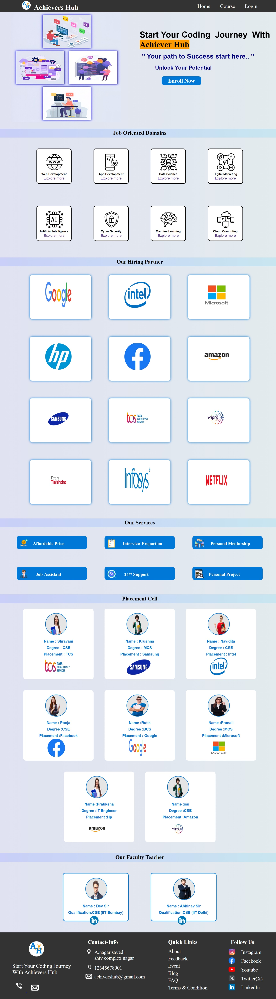

In this project our team develop a online coaching website. This website help you learn new things and and enroll new courses .

When any user visit  our site that user see our home page and in that home  page user will see the some facility of our insistitute and some other feauters 

# 1 Home page

  **Above home page show the   Courses And Login option show   in the  navigation bar you will click the Courses option  you will redirect to the  our course page and also you click to  the login option  you will redirect to the login page**

**you will go to the course  page  and in that page you will two option  first is course explore and  second i s course buying option you will click the course explore page you are able to see overall information about the course.and also you will click the course buy option you are  enroll  to that particular course**

**In this project our team uses HTML and CSS technology for deveoping  this project**

- HTML -  HTML uses for deveolping a basic structure of website .

- CSS - CSS use for designing a webpage.

- Contributor in that project
   
   

          **Thanks for Visiting**
